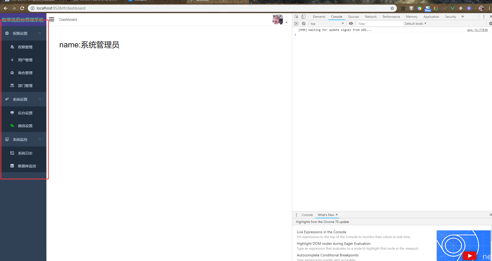
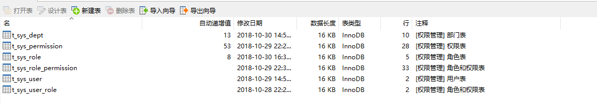
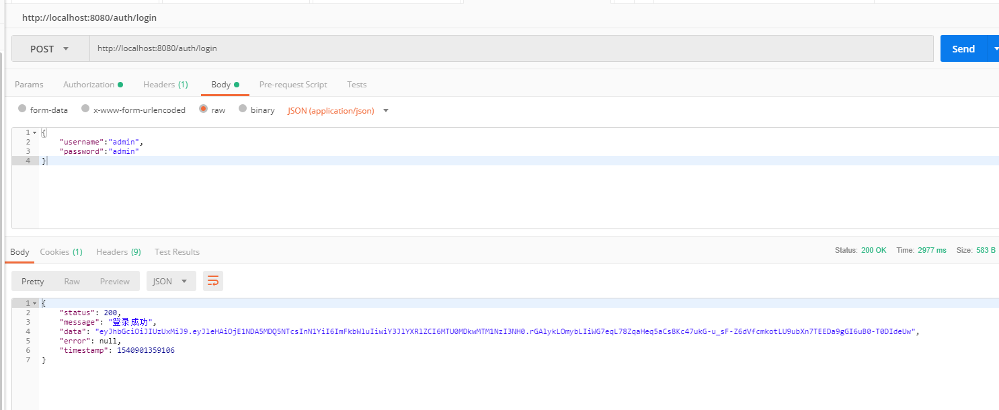
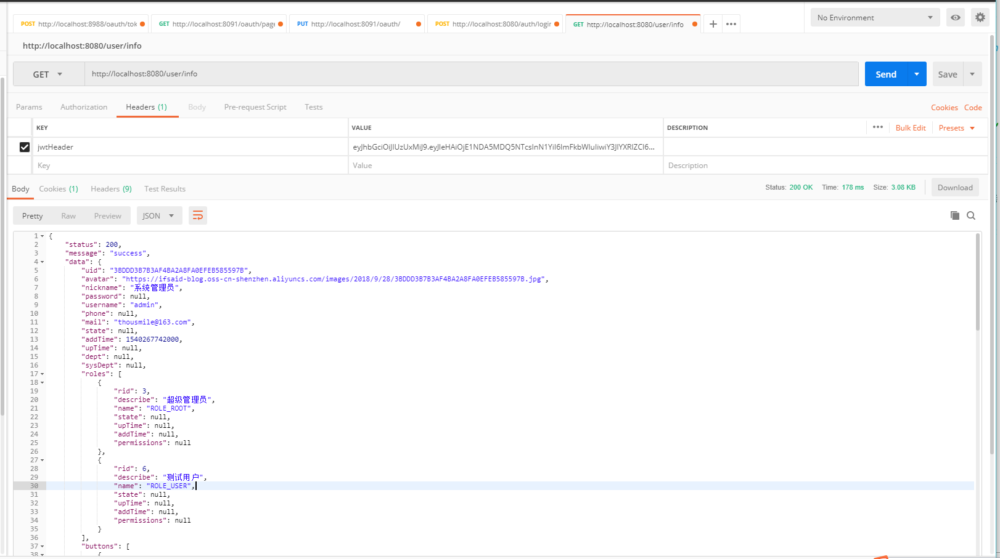

# spring boot security jwt 整合vue-admin-template  项目模板

首先感谢[PanJiaChen](https://github.com/PanJiaChen) 的 vue-admin-template 模板，我是一名java程序员，所以前端的技术不怎么样。vue.js也只是会用一点，非常感谢[PanJiaChen](https://github.com/PanJiaChen) 的模板支持。

如果大家觉得写的不错，就请点亮我[GitHub](https://github.com/thousmile/spring-admin-vue)的心心。非常感谢！

如果大家在搭建过程中遇到问题，欢迎找我

QQ:    932560435

GitHub   ：  https://github.com/thousmile

码云：  https://gitee.com/thousmile

简单的问题不要打扰我，如果有问题直接说什么问题，不要问在不在！！！    


## 效果图




## 先从数据库开始

大部分的权限管理系统都是5张表结构（同样我们这里也采用这种方式）



### **t_sys_user -----> t_sys_user_role  -----> t_sys_role -----> t_sys_role_permission ----> t_sys_permission**

这里我们主要看权限表（t_sys_permission ）


最重要的就是resources和type字段，这两个字段在后面和vue.js整合的时候会用到，

### type字段，只有两个类型，是按钮还是菜单

## **下面开始spring boot 工程的搭建 POM文件的主要依赖**

```java
<dependencies>

        <dependency>
            <groupId>org.springframework.boot</groupId>
            <artifactId>spring-boot-starter-web</artifactId>
        </dependency>

        <dependency>
            <groupId>org.mybatis.spring.boot</groupId>
            <artifactId>mybatis-spring-boot-starter</artifactId>
            <version>1.3.2</version>
        </dependency>

        <dependency>
            <groupId>com.github.pagehelper</groupId>
            <artifactId>pagehelper-spring-boot-starter</artifactId>
            <version>1.2.5</version>
        </dependency>

        <dependency>
            <groupId>mysql</groupId>
            <artifactId>mysql-connector-java</artifactId>
            <scope>runtime</scope>
        </dependency>

        <dependency>
            <groupId>org.springframework.boot</groupId>
            <artifactId>spring-boot-configuration-processor</artifactId>
            <optional>true</optional>
        </dependency>

        <dependency>
            <groupId>org.projectlombok</groupId>
            <artifactId>lombok</artifactId>
            <optional>true</optional>
        </dependency>

        <dependency>
            <groupId>org.springframework.boot</groupId>
            <artifactId>spring-boot-starter-test</artifactId>
            <scope>test</scope>
        </dependency>

        <dependency>
            <groupId>org.apache.commons</groupId>
            <artifactId>commons-lang3</artifactId>
            <version>3.7</version>
        </dependency>

        <!-- ————————————— security开始————————————————————— -->
        <dependency>
            <groupId>org.springframework.boot</groupId>
            <artifactId>spring-boot-starter-security</artifactId>
        </dependency>

        <dependency>
            <groupId>io.jsonwebtoken</groupId>
            <artifactId>jjwt</artifactId>
            <version>0.9.0</version>
        </dependency>

    </dependencies>
```

### 然后在application.yml文件中添加jwt的配置

```

jwt: 
  header: jwtHeader   #jwt的请求头
  secret: eyJleHAiOjE1NDMyMDUyODUsInN1YiI6ImFkbWluIiwiY3Jl   #jwt的加密字符串
  expiration: 3600000   #jwt token有效时间（毫秒）
  route:
    login: /auth/login    #登录地址
    refresh: /auth/refresh  #刷新token地址
    register: /auth/register  #注册的地址
```

### **JwtUser类   显示spring security 规定的 UserDetails 接口**

```
package com.ifsaid.admin.common.jwt;

import com.fasterxml.jackson.annotation.JsonIgnore;
import org.springframework.security.core.GrantedAuthority;
import org.springframework.security.core.userdetails.UserDetails;

import java.util.Collection;

/**
 * @author: Wang Chen Chen
 * @Date: 2018/10/29 14:08
 * @describe：
 * @version: 1.0
 */
public class JwtUser implements UserDetails {

    private String username;

    private String password;

    private Integer state;

    private Collection<? extends GrantedAuthority> authorities;

    public JwtUser() {
    }

    public JwtUser(String username, String password, Integer state, Collection<? extends GrantedAuthority> authorities) {
        this.username = username;
        this.password = password;
        this.state = state;
        this.authorities = authorities;
    }

    @Override
    public String getUsername() {
        return username;
    }

    @JsonIgnore
    @Override
    public String getPassword() {
        return password;
    }

    @Override
    public Collection<? extends GrantedAuthority> getAuthorities() {
        return authorities;
    }

    @JsonIgnore
    @Override
    public boolean isAccountNonExpired() {
        return true;
    }

    @JsonIgnore
    @Override
    public boolean isAccountNonLocked() {
        return state == 1;
    }

    @JsonIgnore
    @Override
    public boolean isCredentialsNonExpired() {
        return true;
    }

    @JsonIgnore
    @Override
    public boolean isEnabled() {
        return true;
    }
}

```

### **创建JwtTokenUtil 的工具类**

```java
package com.ifsaid.admin.common.jwt;

import io.jsonwebtoken.Claims;
import io.jsonwebtoken.Jwts;
import io.jsonwebtoken.SignatureAlgorithm;
import lombok.Data;
import org.springframework.beans.factory.annotation.Value;
import org.springframework.boot.context.properties.ConfigurationProperties;
import org.springframework.security.core.userdetails.UserDetails;
import org.springframework.stereotype.Component;

import java.io.Serializable;
import java.util.Date;
import java.util.HashMap;
import java.util.Map;

/**
 * @author: Wang Chen Chen
 * @Date: 2018/10/29 14:10
 * @describe：
 * @version: 1.0
 */

@Data
@ConfigurationProperties(prefix = "jwt")
@Component
public class JwtTokenUtil implements Serializable {

    private String secret;

    private Long expiration;

    private String header;

    /**
     * 从数据声明生成令牌
     *
     * @param claims 数据声明
     * @return 令牌
     */
    private String generateToken(Map<String, Object> claims) {
        Date expirationDate = new Date(System.currentTimeMillis() + expiration);
        return Jwts.builder().setClaims(claims).setExpiration(expirationDate).signWith(SignatureAlgorithm.HS512, secret).compact();
    }

    /**
     * 从令牌中获取数据声明
     *
     * @param token 令牌
     * @return 数据声明
     */
    private Claims getClaimsFromToken(String token) {
        Claims claims;
        try {
            claims = Jwts.parser().setSigningKey(secret).parseClaimsJws(token).getBody();
        } catch (Exception e) {
            claims = null;
        }
        return claims;
    }

    /**
     * 生成令牌
     *
     * @param userDetails 用户
     * @return 令牌
     */
    public String generateToken(UserDetails userDetails) {
        Map<String, Object> claims = new HashMap<>(2);
        claims.put("sub", userDetails.getUsername());
        claims.put("created", new Date());
        return generateToken(claims);
    }

    /**
     * 从令牌中获取用户名
     *
     * @param token 令牌
     * @return 用户名
     */
    public String getUsernameFromToken(String token) {
        String username;
        try {
            Claims claims = getClaimsFromToken(token);
            username = claims.getSubject();
        } catch (Exception e) {
            username = null;
        }
        return username;
    }

    /**
     * 判断令牌是否过期
     *
     * @param token 令牌
     * @return 是否过期
     */
    public Boolean isTokenExpired(String token) {
        try {
            Claims claims = getClaimsFromToken(token);
            Date expiration = claims.getExpiration();
            return expiration.before(new Date());
        } catch (Exception e) {
            return false;
        }
    }

    /**
     * 刷新令牌
     *
     * @param token 原令牌
     * @return 新令牌
     */
    public String refreshToken(String token) {
        String refreshedToken;
        try {
            Claims claims = getClaimsFromToken(token);
            claims.put("created", new Date());
            refreshedToken = generateToken(claims);
        } catch (Exception e) {
            refreshedToken = null;
        }
        return refreshedToken;
    }

    /**
     * 验证令牌
     *
     * @param token       令牌
     * @param userDetails 用户
     * @return 是否有效
     */
    public Boolean validateToken(String token, UserDetails userDetails) {
        JwtUser user = (JwtUser) userDetails;
        String username = getUsernameFromToken(token);
        return (username.equals(user.getUsername()) && !isTokenExpired(token));
    }

}

```

### **创建jwt认证token拦截器 JwtAuthenticationTokenFilter**

```
package com.ifsaid.admin.common.jwt;

import lombok.extern.slf4j.Slf4j;
import org.apache.commons.lang3.StringUtils;
import org.springframework.beans.factory.annotation.Autowired;
import org.springframework.security.authentication.UsernamePasswordAuthenticationToken;
import org.springframework.security.core.context.SecurityContextHolder;
import org.springframework.security.core.userdetails.UserDetails;
import org.springframework.security.core.userdetails.UserDetailsService;
import org.springframework.security.web.authentication.WebAuthenticationDetailsSource;
import org.springframework.stereotype.Component;
import org.springframework.web.filter.OncePerRequestFilter;

import javax.servlet.FilterChain;
import javax.servlet.ServletException;
import javax.servlet.http.HttpServletRequest;
import javax.servlet.http.HttpServletResponse;
import java.io.IOException;

/**
 * @author: Wang Chen Chen
 * @Date: 2018/10/29 14:29
 * @describe：
 * @version: 1.0
 */

@Slf4j
@Component
public class JwtAuthenticationTokenFilter extends OncePerRequestFilter {

    @Autowired
    private UserDetailsService userDetailsService;

    @Autowired
    private JwtTokenUtil jwtTokenUtil;

    @Override
    protected void doFilterInternal(HttpServletRequest request, HttpServletResponse response, FilterChain chain) throws ServletException, IOException {
    
    	// 从这里开始获取 request 中的 jwt token
        String authHeader = request.getHeader(jwtTokenUtil.getHeader());
        log.info("authHeader：{}", authHeader);
        // 验证token是否存在
        if (authHeader != null && StringUtils.isNotEmpty(authHeader)) {
        	// 根据token 获取用户名
            String username = jwtTokenUtil.getUsernameFromToken(authHeader);
            if (username != null && SecurityContextHolder.getContext().getAuthentication() == null) {
                // 通过用户名 获取用户的信息
                UserDetails userDetails = this.userDetailsService.loadUserByUsername(username);
                
                // 验证token和用户是否匹配
                if (jwtTokenUtil.validateToken(authHeader, userDetails)) {
                    // 然后把构造UsernamePasswordAuthenticationToken对象
                    // 最后绑定到当前request中，在后面的请求中就可以获取用户信息
                    UsernamePasswordAuthenticationToken authentication = new UsernamePasswordAuthenticationToken(userDetails, null, userDetails.getAuthorities());
                    authentication.setDetails(new WebAuthenticationDetailsSource().buildDetails(request));
                    SecurityContextHolder.getContext().setAuthentication(authentication);
                }
            }
        }
        chain.doFilter(request, response);
    }
}

```

### **实现spring Security 的UserDetailsService 接口**

```java
package com.ifsaid.admin.service.impl;

import com.ifsaid.admin.common.jwt.JwtUser;
import com.ifsaid.admin.entity.SysRole;
import com.ifsaid.admin.entity.SysUser;
import com.ifsaid.admin.mapper.SysUserMapper;
import lombok.extern.slf4j.Slf4j;
import org.apache.commons.lang3.StringUtils;
import org.springframework.beans.factory.annotation.Autowired;
import org.springframework.security.core.authority.SimpleGrantedAuthority;
import org.springframework.security.core.userdetails.UserDetails;
import org.springframework.security.core.userdetails.UserDetailsService;
import org.springframework.security.core.userdetails.UsernameNotFoundException;
import org.springframework.stereotype.Service;

import java.util.List;
import java.util.stream.Collectors;

/**
 * @author: Wang Chen Chen
 * @Date: 2018/10/29 14:15
 * @describe：
 * @version: 1.0
 */

@Slf4j
@Service
public class JwtUserDetailsServiceImpl implements UserDetailsService {

    @Autowired
    private SysUserMapper sysUserMapper;

    @Override
    public UserDetails loadUserByUsername(String username) throws UsernameNotFoundException {
        // 根据用户名获取数据库的用户信息
        SysUser sysUser = sysUserMapper.selectByUserName(username);
        if (sysUser == null || StringUtils.isEmpty(sysUser.getUid())) {
            throw new UsernameNotFoundException(String.format("'%s'.这个用户不存在", username));
        } else {
            // 根据数据库中的用户信息，构建JwtUser对象
            List<SimpleGrantedAuthority> collect = sysUser.getRoles().stream().map(SysRole::getName).map(SimpleGrantedAuthority::new).collect(Collectors.toList());
            return new JwtUser(sysUser.getUsername(), sysUser.getPassword(), sysUser.getState(), collect);
        }
    }


}

```


### **配置 spring Security**

```java
package com.ifsaid.admin.config;

import com.ifsaid.admin.common.jwt.JwtAuthenticationTokenFilter;
import org.springframework.context.annotation.Bean;
import org.springframework.context.annotation.Configuration;
import org.springframework.security.authentication.AuthenticationManager;
import org.springframework.security.config.BeanIds;
import org.springframework.security.config.annotation.web.configuration.EnableWebSecurity;
import org.springframework.security.config.annotation.web.configuration.WebSecurityConfigurerAdapter;

import org.springframework.beans.factory.annotation.Autowired;
import org.springframework.http.HttpMethod;
import org.springframework.security.config.annotation.authentication.builders.AuthenticationManagerBuilder;
import org.springframework.security.config.annotation.method.configuration.EnableGlobalMethodSecurity;
import org.springframework.security.config.annotation.web.builders.HttpSecurity;
import org.springframework.security.config.annotation.web.configurers.ExpressionUrlAuthorizationConfigurer;
import org.springframework.security.config.http.SessionCreationPolicy;
import org.springframework.security.core.userdetails.UserDetailsService;
import org.springframework.security.crypto.bcrypt.BCryptPasswordEncoder;
import org.springframework.security.crypto.password.PasswordEncoder;
import org.springframework.security.web.authentication.UsernamePasswordAuthenticationFilter;
import org.springframework.web.cors.CorsConfiguration;
import org.springframework.web.cors.CorsUtils;
import org.springframework.web.cors.UrlBasedCorsConfigurationSource;
import org.springframework.web.filter.CorsFilter;


/**
 * @author: Wang Chen Chen
 * @Date: 2018/10/29 11:41
 * @describe：
 * @version: 1.0
 */
@Configuration
@EnableWebSecurity
@EnableGlobalMethodSecurity(prePostEnabled = true)
public class WebMvcConfig extends WebSecurityConfigurerAdapter {

    @Autowired
    private UserDetailsService userDetailsService;

    @Autowired
    private JwtAuthenticationTokenFilter jwtAuthenticationTokenFilter;

	// 这里记住一定要重新父类的对象，不然在注入 AuthenticationManager时会找不到，
	// 默认spring security 没有给我们注入到容器中
    @Bean(name = BeanIds.AUTHENTICATION_MANAGER)
    @Override
    public AuthenticationManager authenticationManagerBean() throws Exception {
        return super.authenticationManagerBean();
    }

    @Autowired
    public void configureAuthentication(AuthenticationManagerBuilder authenticationManagerBuilder) throws Exception {
        authenticationManagerBuilder.userDetailsService(this.userDetailsService).passwordEncoder(passwordEncoder());
    }

    /**
     * @describe spring Security的核心配置
     * @date 2018/10/29
     * @author Wang Chen Chen
     */
    @Override
    protected void configure(HttpSecurity httpSecurity) throws Exception {
        httpSecurity.csrf().disable().sessionManagement().sessionCreationPolicy(SessionCreationPolicy.STATELESS)
                .and().authorizeRequests()
                .antMatchers(HttpMethod.OPTIONS, "/**").permitAll()
                // 把不需要认证的接口暴露出去。登录，刷新token，
                .antMatchers("/auth/**").permitAll()
                .anyRequest().authenticated()
                .and().headers().cacheControl();
		// 注入我们刚才写好的 jwt过滤器
        httpSecurity.addFilterBefore(jwtAuthenticationTokenFilter, UsernamePasswordAuthenticationFilter.class);


		// 这块是配置跨域请求的        ExpressionUrlAuthorizationConfigurer<HttpSecurity>.ExpressionInterceptUrlRegistry registry = httpSecurity.authorizeRequests();
        //让Spring security放行所有preflight request
        registry.requestMatchers(CorsUtils::isPreFlightRequest).permitAll();
    }

   // 这块是配置跨域请求的
    @Bean
    public CorsFilter corsFilter() {
        final UrlBasedCorsConfigurationSource urlBasedCorsConfigurationSource = new UrlBasedCorsConfigurationSource();
        final CorsConfiguration cors = new CorsConfiguration();
        cors.setAllowCredentials(true);
        cors.addAllowedOrigin("*");
        cors.addAllowedHeader("*");
        cors.addAllowedMethod("*");
        urlBasedCorsConfigurationSource.registerCorsConfiguration("/**", cors);
        return new CorsFilter(urlBasedCorsConfigurationSource);
    }

   // 密码加密
    @Bean
    public PasswordEncoder passwordEncoder() {
        return new BCryptPasswordEncoder();
    }

}
```

**登录的接口**

```java
package com.ifsaid.admin.service;

import com.ifsaid.admin.common.exception.UserExistsException;
import com.ifsaid.admin.common.service.IBaseService;
import com.ifsaid.admin.entity.SysUser;
import com.ifsaid.admin.vo.SysUserVo;
import org.springframework.security.core.AuthenticationException;

/**
 * <p>
 * [权限管理] 用户表 服务类
 * </p>
 *
 * @author wang chen chen
 * @since 2018-10-23
 */
public interface ISysUserService extends IBaseService<SysUser, String> {

    SysUser findByUsername(String username);


    /**
     * 获取用户详细信息
     * @param username
     * @return 操作结果
     */
    SysUserVo findUserInfo(String username);

    /**
     * 用户登录
     *
     * @param username 用户名
     * @param password 密码
     * @return 操作结果
     */
    String login(String username, String password) throws AuthenticationException;

    /**
     * 用户注册
     *
     * @param user 用户信息
     * @return 操作结果
     */
    Integer register(SysUser sysUser) throws UserExistsException;

    /**
     * 刷新密钥
     *
     * @param oldToken 原密钥
     * @return 新密钥
     */
    String refreshToken(String oldToken);

}

```

### **登录接口的实现类**

```java
package com.ifsaid.admin.service.impl;

import com.ifsaid.admin.common.exception.UserExistsException;
import com.ifsaid.admin.common.jwt.JwtTokenUtil;
import com.ifsaid.admin.common.service.impl.BaseServiceImpl;
import com.ifsaid.admin.entity.SysRole;
import com.ifsaid.admin.entity.SysUser;
import com.ifsaid.admin.mapper.SysUserMapper;
import com.ifsaid.admin.service.ISysRoleService;
import com.ifsaid.admin.service.ISysUserService;
import com.ifsaid.admin.utils.TreeBuilder;
import com.ifsaid.admin.vo.ButtonVo;
import com.ifsaid.admin.vo.MenuVo;
import com.ifsaid.admin.vo.SysUserVo;
import lombok.extern.slf4j.Slf4j;
import org.apache.commons.collections.CollectionUtils;
import org.apache.commons.lang3.StringUtils;
import org.springframework.security.core.userdetails.UsernameNotFoundException;
import org.springframework.security.crypto.password.PasswordEncoder;
import org.springframework.stereotype.Service;

import org.springframework.beans.factory.annotation.Autowired;
import org.springframework.security.authentication.AuthenticationManager;
import org.springframework.security.authentication.UsernamePasswordAuthenticationToken;
import org.springframework.security.core.Authentication;
import org.springframework.security.core.context.SecurityContextHolder;
import org.springframework.security.core.userdetails.UserDetails;
import org.springframework.security.core.userdetails.UserDetailsService;

import java.util.Date;
import java.util.HashSet;
import java.util.List;
import java.util.Set;

/**
 * <p>
 * [权限管理] 用户表 服务实现类
 * </p>
 *
 * @author wang chen chen
 * @since 2018-10-23
 */

@Slf4j
@Service
public class SysUserServiceImpl extends BaseServiceImpl<SysUser, String, SysUserMapper> implements ISysUserService {

    @Autowired
    private ISysRoleService sysRoleService;

    @Override
    public SysUser findByUsername(String username) throws UsernameNotFoundException {
        if (StringUtils.isEmpty(username)) {
            throw new UsernameNotFoundException("用户名不可以为空!");
        }
        SysUser sysUser = baseMapper.selectByUserName(username);
        if (sysUser == null || StringUtils.isEmpty(sysUser.getUid()) || StringUtils.isEmpty(sysUser.getUsername())) {
            throw new UsernameNotFoundException("用户名不存在!");
        }
        log.info("SysUserServiceImpl......... {}", sysUser);
        return sysUser;
    }

    @Override
    public SysUserVo findUserInfo(String username) {
        /**
         * 获取用户信息
         */
        SysUser sysUser = findByUsername(username);
        /**
         * 获取当前用户的所有角色
         */
        Set<SysRole> sysRoles = sysRoleService.selectByUserName(username);
        
         /**
         * 在这里我的想法是，构建一个按钮权限列表
         * 再构建一个菜单权限列表
         * 这样的我们在前端的写的时候，就不用解析的很麻烦了
         * 因为权限表是一张表，在这里解析好了以后，
         * 相当前端少做一点工作，当然这也可以放到前端去解析权限列表
         */
        Set<ButtonVo> buttonVos = new HashSet<>();
        Set<MenuVo> menuVos = new HashSet<>();

        sysRoles.forEach(role -> {
            log.info("role: {}", role.getDescribe());
            role.getPermissions().forEach(permission -> {
                if (permission.getType().toLowerCase().equals("button")) {
                    /*
                    * 如果权限是按钮，就添加到按钮里面
                    * */
                    buttonVos.add(new ButtonVo(permission.getPid(), permission.getResources(), permission.getTitle()));
                }
                if (permission.getType().toLowerCase().equals("menu")) {
                    /*
                    * 如果权限是菜单，就添加到菜单里面
                    * */
                    menuVos.add(new MenuVo(permission.getPid(), permission.getFather(), permission.getIcon(), permission.getResources(), permission.getTitle()));
                }
            });
        });

        /**
        * 注意这个类 TreeBuilder。因为的vue router是以递归的形式呈现菜单
        * 所以我们需要把菜单跟vue router 的格式一一对应 而按钮是不需要的
        */
        SysUserVo sysUserVo =
                new SysUserVo(sysUser.getUid(), sysUser.getAvatar(),
                        sysUser.getNickname(), sysUser.getUsername(),
                        sysUser.getMail(), sysUser.getAddTime(),
                        sysUser.getRoles(), buttonVos, TreeBuilder.findRoots(menuVos));
        return sysUserVo;
    }

    // 如果在WebSecurityConfigurerAdapter中，没有重新，这里就会报注入失败的异常
    @Autowired
    private AuthenticationManager authenticationManager;

    @Autowired
    private UserDetailsService userDetailsService;

    @Autowired
    private JwtTokenUtil jwtTokenUtil;

    @Autowired
    private PasswordEncoder passwordEncoder;

    @Override
    public String login(String username, String password) {
        UsernamePasswordAuthenticationToken upToken = new UsernamePasswordAuthenticationToken(username, password);
        Authentication authentication = authenticationManager.authenticate(upToken);
        SecurityContextHolder.getContext().setAuthentication(authentication);
        UserDetails userDetails = userDetailsService.loadUserByUsername(username);
        return jwtTokenUtil.generateToken(userDetails);
    }

    @Override
    public Integer register(SysUser sysUser) throws UserExistsException {
        String username = sysUser.getUsername();
        if (findByUsername(username) != null) {
            throw new UserExistsException(String.format("'%s' 这个用用户已经存在了", username));
        }
        String rawPassword = sysUser.getPassword();
        sysUser.setPassword(passwordEncoder.encode(rawPassword));
        sysUser.setUpTime(new Date());
        sysUser.setAddTime(new Date());
        return baseMapper.insertSelective(sysUser);
    }

    @Override
    public String refreshToken(String oldToken) {
        if (!jwtTokenUtil.isTokenExpired(oldToken)) {
            return jwtTokenUtil.refreshToken(oldToken);
        }
        return "error";
    }

}

```

### **登录刷新token的Controller**

```
package com.ifsaid.admin.controller;

import com.ifsaid.admin.service.ISysUserService;
import com.ifsaid.admin.vo.Result;
import org.apache.commons.lang3.StringUtils;
import org.springframework.beans.factory.annotation.Autowired;
import org.springframework.web.bind.annotation.*;

import java.util.Map;

/**
 * @author: Wang Chen Chen
 * @Date: 2018/10/29 10:49
 * @describe：
 * @version: 1.0
 */

@RestController
public class AuthController {

    @Autowired
    private ISysUserService sysUserService;

    @PostMapping(value = "${jwt.route.login}")
    public Result<String> login(@RequestBody Map<String, String> map) {
        String username = map.get("username");
        String password = map.get("password");
        if (StringUtils.isEmpty(username) || StringUtils.isEmpty(password)) {
            return Result.error401("用户或者密码不能为空！", null);
        }
        return Result.success("登录成功", sysUserService.login(username, password));
    }

    @PostMapping(value = "${jwt.route.refresh}")
    public Result<String> refresh(@RequestHeader("${jwt.header}") String token) {
        return Result.success("刷新token成功!", sysUserService.refreshToken(token));
    }

}

```



**到这里我们已经获取到 token。**

### **然后根据token获取获取用户信息**



### **json格式**

```
{
    "status": 200,
    "message": "success",
    "data": {
        "uid": "3BDDD3B7B3AF4BA2A8FA0EFEB585597B",
        "avatar": "https://ifsaid-blog.oss-cn-shenzhen.aliyuncs.com/images/2018/9/28/3BDDD3B7B3AF4BA2A8FA0EFEB585597B.jpg",
        "nickname": "系统管理员",
        "password": null,
        "username": "admin",
        "phone": null,
        "mail": "thousmile@163.com",
        "state": null,
        "addTime": 1540267742000,
        "upTime": null,
        "dept": null,
        "sysDept": null,
        "roles": [
            {
                "rid": 3,
                "describe": "超级管理员",
                "name": "ROLE_ROOT",
                "state": null,
                "upTime": null,
                "addTime": null,
                "permissions": null
            },
            {
                "rid": 6,
                "describe": "测试用户",
                "name": "ROLE_USER",
                "state": null,
                "upTime": null,
                "addTime": null,
                "permissions": null
            }
        ],
        "buttons": [
            {
                "pid": 47,
                "resources": "dept:update",
                "title": "修改部门"
            },
            {
                "pid": 41,
                "resources": "role:new",
                "title": "新增角色"
            },
            {
                "pid": 34,
                "resources": "perm:delete",
                "title": "删除权限"
            },
            {
                "pid": 38,
                "resources": "user:delete",
                "title": "删除用户"
            },
            {
                "pid": 40,
                "resources": "user:view",
                "title": "查看用户"
            },
            {
                "pid": 44,
                "resources": "role:view",
                "title": "查看角色"
            },
            {
                "pid": 42,
                "resources": "role:delete",
                "title": "删除角色"
            },
            {
                "pid": 35,
                "resources": "perm:update",
                "title": "修改权限"
            },
            {
                "pid": 48,
                "resources": "dept:view",
                "title": "查看部门"
            },
            {
                "pid": 37,
                "resources": "user:new",
                "title": "新增用户"
            },
            {
                "pid": 33,
                "resources": "perm:new",
                "title": "新增权限"
            },
            {
                "pid": 43,
                "resources": "role:update",
                "title": "修改角色"
            },
            {
                "pid": 45,
                "resources": "dept:new",
                "title": "新增部门"
            },
            {
                "pid": 39,
                "resources": "user:update",
                "title": "修改用户"
            },
            {
                "pid": 36,
                "resources": "perm:view",
                "title": "查看权限"
            },
            {
                "pid": 46,
                "resources": "dept:delete",
                "title": "删除部门"
            }
        ],
        "menus": [
            {
                "pid": 2,
                "father": 0,
                "icon": "sys_set",
                "resources": "sys",
                "title": "系统设置",
                "children": [
                    {
                        "pid": 51,
                        "father": 2,
                        "icon": "sys_wechat",
                        "resources": "wechat",
                        "title": "微信设置",
                        "children": null
                    },
                    {
                        "pid": 52,
                        "father": 2,
                        "icon": "sys_backstage",
                        "resources": "backstage",
                        "title": "后台设置",
                        "children": null
                    }
                ]
            },
            {
                "pid": 4,
                "father": 0,
                "icon": "time_task",
                "resources": "task",
                "title": "定时任务",
                "children": null
            },
            {
                "pid": 1,
                "father": 0,
                "icon": "pre_admin",
                "resources": "pre",
                "title": "权限设置",
                "children": [
                    {
                        "pid": 32,
                        "father": 1,
                        "icon": "dept__admin",
                        "resources": "dept",
                        "title": "部门管理",
                        "children": null
                    },
                    {
                        "pid": 30,
                        "father": 1,
                        "icon": "user__admin",
                        "resources": "user",
                        "title": "用户管理",
                        "children": null
                    },
                    {
                        "pid": 31,
                        "father": 1,
                        "icon": "role__admin",
                        "resources": "role",
                        "title": "角色管理",
                        "children": null
                    },
                    {
                        "pid": 29,
                        "father": 1,
                        "icon": "prem_admin",
                        "resources": "perm",
                        "title": "权限管理",
                        "children": null
                    }
                ]
            },
            {
                "pid": 3,
                "father": 0,
                "icon": "sys_control",
                "resources": "control",
                "title": "系统监控",
                "children": [
                    {
                        "pid": 50,
                        "father": 3,
                        "icon": "control_logs",
                        "resources": "logs",
                        "title": "系统日志",
                        "children": null
                    },
                    {
                        "pid": 49,
                        "father": 3,
                        "icon": "control_database",
                        "resources": "database",
                        "title": "数据库监控",
                        "children": null
                    }
                ]
            }
        ]
    },
    "error": null,
    "timestamp": 1540901472256
}
```

**可以划分为三个主要部分**

**1.用户信息**

**2.菜单列表（递归形式）**

**3.按钮列表（List列表形式）**

## 然后开始整合[**vue-element-admin**](https://github.com/PanJiaChen/vue-element-admin/blob/master/README.zh-CN.md)

先看一下成果。


从GitHub上面拉去[**vue-element-admin**](https://github.com/PanJiaChen/vue-element-admin/blob/master/README.zh-CN.md)


```npm
# 克隆项目
git clone https://github.com/PanJiaChen/vue-admin-template.git

# 建议不要用cnpm  安装有各种诡异的bug 可以通过如下操作解决npm速度慢的问题
npm install --registry=https://registry.npm.taobao.org

# Serve with hot reload at localhost:9528
npm run dev
```

**1.改登录的api接口指向我们spring boot 的登录**   目录 /src/api/login.js 

```js
import request from '@/utils/request'

// 登录
export function login(username, password) {
  return request({ url: '/auth/login', method: 'post', data: { username, password }})
}

// 获取用户信息
export function getInfo(token) {
  return request({ url: 'user/info', method: 'get' })
}

// 登出
export function logout() {
  return request({ url: 'user/logout', method: 'post' })
}

```

### **2.改axios的配置 目录**   /src/utils/request.js

```js
import axios from 'axios'
import { Message, MessageBox } from 'element-ui'
import store from '../store'
import { getToken } from '@/utils/auth'

// 创建axios实例
const service = axios.create({
  baseURL: process.env.BASE_API, // api 的 base_url
  timeout: 5000 // 请求超时时间
})

// request拦截器
service.interceptors.request.use(
  config => {
    if (getToken() !== '') {
      config.headers['jwtHeader'] = getToken() // 让每个请求携带自定义token 请根据实际情况自行修改
    }
    return config
  },
  error => {
    // Do something with request error
    console.log(error) // for debug
    Promise.reject(error)
  }
)

// response 拦截器
service.interceptors.response.use(
  response => {
    /**
     * code为非20000是抛错 可结合自己业务进行修改
     */
    const res = response.data
    if (res.status !== 200) {
      Message({
        message: res.message,
        type: 'error',
        duration: 5 * 1000
      })

      // 50008:非法的token; 50012:其他客户端登录了;  50014:Token 过期了;
      if (res.code === 400 || res.code === 401 || res.code === 402) {
        MessageBox.confirm('你已被登出，可以取消继续留在该页面，或者重新登录', '确定登出',
          { confirmButtonText: '重新登录',
            cancelButtonText: '取消',
            type: 'warning'
          }
        ).then(() => {
          store.dispatch('FedLogOut').then(() => {
            location.reload() // 为了重新实例化vue-router对象 避免bug
          })
        })
      }
      return Promise.reject('error')
    } else {
      return response.data
    }
  },
  error => {
    console.log('err' + error) // for debug
    Message({
      message: error.message,
      type: 'error',
      duration: 5 * 1000
    })
    return Promise.reject(error)
  }
)

export default service

```

### **3.改/config/dev.env.js 和/config/prod.env.js**

```javascript
// dev.env.js

'use strict'
const merge = require('webpack-merge')
const prodEnv = require('./prod.env')

module.exports = merge(prodEnv, {
  NODE_ENV: '"development"',
  BASE_API: '"http://localhost:8080"',
})


// prod.env.js

'use strict'
module.exports = {
  NODE_ENV: '"production"',
  BASE_API: '"http://localhost:8080"',
}


```

### **4.改vuex 设置token的登录，和获取用户信息**    目录 /src/store/modules/user.js

```javascript
import { login, logout, getInfo } from '@/api/login'
import { getToken, setToken, removeToken } from '@/utils/auth'

const user = {
  state: {
    token: getToken(),
    nickname: '',
    avatar: '',
    uid: '',
    user: {},
    roles: [],
    menus: [], // 菜单权限
    buttons: [] // 安装权限
  },

  mutations: {
    SET_TOKEN: (state, token) => {
      state.token = token
    },
    SET_INFO: (state, user) => {
      state.nickname = user.nickname
      state.avatar = user.avatar
      state.uid = user.uid
      state.user = user
    },
    SET_ROLES: (state, roles) => {
      state.roles = roles
    },
    SET_MENUS: (state, menus) => {
      state.menus = menus
    },
    SET_BUTTONS: (state, buttons) => {
      state.buttons = buttons
    }
  },

  actions: {
    // 登录
    Login({ commit }, userInfo) {
      const username = userInfo.username.trim()
      return new Promise((resolve, reject) => {
        login(username, userInfo.password).then(res => {
          setToken(res.data)
          commit('SET_TOKEN', res.data)
          resolve()
        }).catch(error => {
          reject(error)
        })
      })
    },

    // 获取用户信息
    GetInfo({ commit, state }) {
      return new Promise((resolve, reject) => {
        getInfo(state.token).then(res => {
          const data = res.data
          if (data.roles && data.roles.length > 0) { // 验证返回的roles是否是一个非空数组
            commit('SET_ROLES', data.roles)
          } else {
            reject('getInfo: roles must be a non-null array !')
          }
          commit('SET_MENUS', data.menus)
          commit('SET_BUTTONS', data.buttons)
          // 设置用户信息
          commit('SET_INFO', data)
          resolve(res)
        }).catch(error => {
          reject(error)
        })
      })
    },

    // 登出
    LogOut({ commit, state }) {
      return new Promise((resolve, reject) => {
        logout(state.token).then(() => {
          commit('SET_INFO', '')
          commit('SET_TOKEN', '')
          commit('SET_ROLES', [])
          removeToken()
          resolve()
        }).catch(error => {
          reject(error)
        })
      })
    },

    // 前端 登出
    FedLogOut({ commit }) {
      return new Promise(resolve => {
        commit('SET_TOKEN', '')
        removeToken()
        resolve()
      })
    }
  }
}

export default user

```

### **5.改vue router**  目录 /src/router/index.js

```javascript
import Vue from 'vue'
import Router from 'vue-router'

Vue.use(Router)

import Layout from '@/views/layout/Layout'
// 默认的路由链。所有用户公共的路由
export const constantRouterMap = [
  {
    path: '/login',
    name: 'Login',
    component: () =>
      import('@/views/login/index'),
    hidden: true
  },

  {
    path: '/',
    component: Layout,
    redirect: '/dashboard',
    name: 'Dashboard',
    hidden: true,
    children: [{
      path: 'dashboard',
      component: () =>
        import('@/views/dashboard/index')
    }, {
      path: 'userinfo',
      name: 'UserInfo',
      component: () =>
        import('@/views/dashboard/userinfo')
    }]
  },

  {
    path: '/error',
    component: Layout,
    redirect: '/error/404',
    hidden: true,
    children: [{
      path: '404',
      component: () =>
        import('@/views/error/404/index')
    }, {
      path: '401',
      component: () =>
        import('@/views/error/401/index')
    }]
  },
  {
    path: '*',
    redirect: '/error/404',
    hidden: true
  }
]

export default new Router({
  // mode: 'history', //后端支持可开
  scrollBehavior: () => ({ y: 0 }),
  routes: constantRouterMap
})

// 异步挂载的路由
// 动态需要根据权限加载的路由表
// 这个路由链，根据数据库中的一一对应，也就是说这是一个最完整的路由链，
// 根据登录的用户权限的不同，然后从中提取出对应当前用户的路由添加到vue router中
// meta:属性中resources属性最为重要，用meta.resources和我们获取用户信息中menus.resources匹配
export const asyncRouterMap = [
  {
    path: '/pre',
    component: Layout,
    name: 'pre',
    meta: {
      resources: 'pre',
      title: '权限管理'
    },
    children: [
      {
        path: 'index',
        component: () => import('@/views/pre/perm/index'),
        name: 'perm',
        meta: {
          resources: 'perm'
        }
      },
      {
        path: 'user',
        component: () => import('@/views/pre/user/index'),
        name: 'user',
        meta: {
          resources: 'user'
        }
      },
      {
        path: 'role',
        component: () => import('@/views/pre/role/index'),
        name: 'role',
        meta: {
          resources: 'role'
        }
      },
      {
        path: 'dept',
        component: () => import('@/views/pre/dept/index'),
        name: 'dept',
        meta: {
          resources: 'dept'
        }
      }
    ]
  },

  {
    path: '/sys',
    component: Layout,
    name: 'sys',
    meta: {
      resources: 'sys',
      title: '系统设置'
    },
    children: [
      {
        path: 'index',
        component: () => import('@/views/sys/backstage/index'),
        name: 'backstage',
        meta: {
          resources: 'backstage'
        }
      },
      {
        path: 'wechat',
        component: () => import('@/views/sys/wechat/index'),
        name: 'wechat',
        meta: {
          resources: 'wechat'
        }
      }
    ]
  },

  {
    path: 'external-link',
    component: Layout,
    name: 'Link',
    meta: {
      resources: 'control',
      title: '系统监控',
      icon: 'link'
    },
    children: [{
      path: 'https://www.baidu.com/',
      meta: {
        resources: 'logs',
        title: '系统日志',
        icon: 'link'
      }
    },
    {
      path: 'https://v.qq.com/',
      meta: {
        resources: 'database',
        title: '数据库监控',
        icon: 'link'
      }
    }
    ]
  }

]

```

### **6.添加权限管理，并且添加vuex中****    目录 /src/store/modules/permission.js

```javascript
// store/permission.js
import { asyncRouterMap, constantRouterMap } from '@/router'

/**
 *
 * @param  {Array} userRouter 后台返回的用户权限json
 * @param  {Array} allRouter  前端配置好的所有动态路由的集合
 * @return {Array} realRoutes 过滤后的路由
 */

export function recursionRouter(userRouter = [], allRouter = []) {
  var realRoutes = []
  allRouter.forEach((v, i) => {
    userRouter.forEach((item, index) => {
      if (item.resources === v.meta.resources) {
        if (item.children && item.children.length > 0) {
          v.children = recursionRouter(item.children, v.children)
        }
        v.meta.title = item.title
        v.meta.icon = item.icon
        realRoutes.push(v)
      }
    })
  })
  return realRoutes
}

/**
*
* @param {Array} routes 用户过滤后的路由
*
* 递归为所有有子路由的路由设置第一个children.path为默认路由
*/
export function setDefaultRoute(routes) {
  routes.forEach((v, i) => {
    if (v.children && v.children.length > 0) {
      v.redirect = { name: v.children[0].name }
      setDefaultRoute(v.children)
    }
  })
}

const permission = {
  state: {
    routers: constantRouterMap, // 这是默认权限列表 比如404 500等路由
    dynamicRouters: [] // 这是通过后台获取的权利列表
  },
  mutations: {
    SET_ROUTERS: (state, routers) => {
      state.dynamicRouters = routers
      state.routers = constantRouterMap.concat(routers)
    }
  },
  actions: {
    GenerateRoutes({ commit }, data) {
      return new Promise(resolve => {
          // 把传进来的menus 列表。用recursionRouter方法进行递归遍历出来，存入vuex中
        commit('SET_ROUTERS', 。(data, asyncRouterMap))
        resolve()
      })
    }
  }
}

export default permission

```

### **7.修改/src/permission.js文件，修改路由调整的条件**

```javascript
import router from './router'
import store from './store'
import NProgress from 'nprogress' // Progress 进度条
import 'nprogress/nprogress.css'// Progress 进度条样式
import { Message } from 'element-ui'
import { getToken } from '@/utils/auth' // 验权

const whiteList = ['/login'] // 不重定向白名单
router.beforeEach((to, from, next) => {
  NProgress.start()
  if (getToken()) {
    if (to.path === '/login') {
      next({ path: '/' })
      NProgress.done() // if current page is dashboard will not trigger	afterEach hook, so manually handle it
    } else {
      if (store.getters.menus.length === 0) {
        // 拉取用户信息(请确保在 GetInfo 方法中 已经获取到菜单列表)
        store.dispatch('GetInfo').then(res => {
          // 动态设置路由（把上一步获取到的用户传递给 GenerateRoutes方法 解析）
          store.dispatch('GenerateRoutes', store.getters.menus).then(r => {
            // 获取已经解析好的路由列表，动态添加到router中
            router.addRoutes(store.getters.dynamicRouters)
            // hack方法 确保addRoutes已完成
            next({ ...to, replace: true })
          })
        }).catch((err) => {
          store.dispatch('FedLogOut').then(() => {
            Message.error(err || 'Verification failed, please login again')
            next({ path: '/' })
          })
        })
      } else {
        next()
      }
    }
  } else {
    if (whiteList.indexOf(to.path) !== -1) {
      next()
    } else {
      next(`/login?redirect=${to.path}`) // 否则全部重定向到登录页
      NProgress.done()
    }
  }
})

router.afterEach(() => {
  NProgress.done() // 结束Progress
})

```

### **8.修改菜单渲染的方式，默认是从vue router中读取路由链，然后渲染，但是我们现在的路由链存在vuex中，**

目录: /src/views/layout/components/Sidebar/index.vue

```javascript
<template>
  <el-scrollbar wrap-class="scrollbar-wrapper">

    <logo :is-collapse="isCollapse"/>

    <el-menu
      :show-timeout="200"
      :default-active="$route.path"
      :collapse="isCollapse"
      mode="vertical"
      background-color="#304156"
      text-color="#bfcbd9"
      active-text-color="#409EFF"
    >
      
   		<!-- 主要就是在这里位置  menu_routers -->
      <sidebar-item v-for="route in menu_routers" :key="route.path" :item="route" :base-path="route.path"/>
    </el-menu>
  </el-scrollbar>
</template>

<script>
import { mapGetters } from 'vuex'
import SidebarItem from './SidebarItem'
import logo from './Logo'

export default {
  components: {
    SidebarItem,
    logo
  },
  computed: {
      // 在这里从vuex 中获取到菜单列表
    ...mapGetters([
      'menu_routers',
      'sidebar'
    ]),
    isCollapse() {
      return !this.sidebar.opened
    }
  }
}
</script>

```

### **到现在为止已经做到动态的菜单了，还剩按钮的权限，按钮比较简单，添加一个vue 的指令即可**

```javascript
import Vue from 'vue'
import store from '@/store'

/** 权限指令**/

Vue.directive('has', {
  bind: function(el, binding) {
    if (!Vue.prototype.$_has(binding.value)) {
      el.parentNode.removeChild(el)
    }
  }
})

// 权限检查方法
Vue.prototype.$_has = function(value) {
  // 获取用户按钮权限
  let isExist = false
  const dynamicButtons = store.getters.buttons
  if (dynamicButtons === undefined || dynamicButtons === null || dynamicButtons.length < 1) {
    return isExist
  }
  dynamicButtons.forEach(button => {
    if (button.resources === value) {
      isExist = true
      return isExist
    }
  })
  return isExist
}

```

### **在页面中测试一下指令是否好用**

```html
    
<!-- v-has中的值就是我们获取用户信息时buttons的resources属性。进行对比， -->

<el-button v-has="'perm:new'" class="btns">添加</el-button>

<el-button v-has="'perm:haha'" class="btns">哈哈</el-button>

```

**到了这里已经完成了  spring boot ，security ，jwt，vue-admin-template的整合 一个完整的前后端分类，动态权限，控制到按钮的 后台管理系统就完成了**


### 有钱的兄弟捧个钱场，没钱的捧个人场


