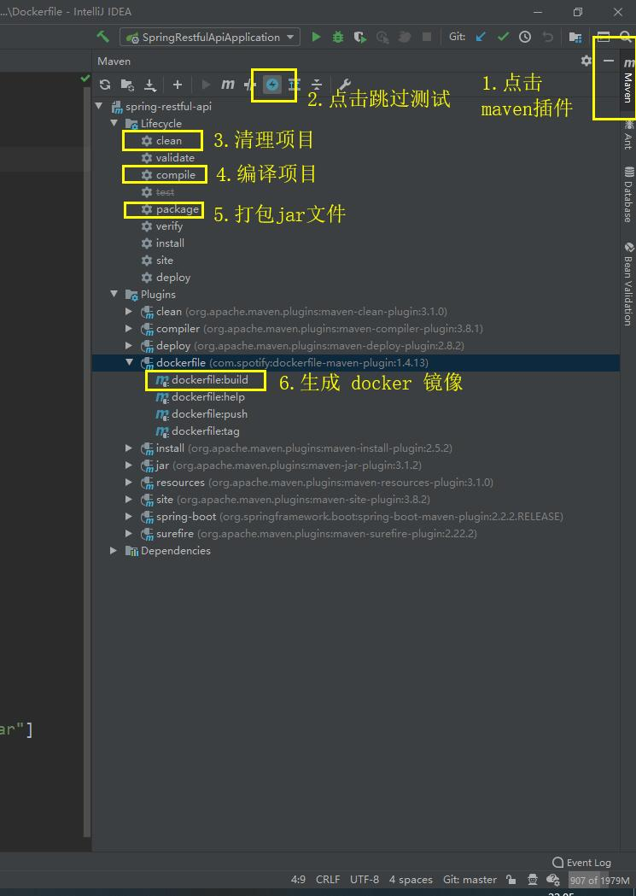

# spring boot security jwt 整合 vue-admin-template 2.0 项目模板，权限控制到按钮！

首先感谢[PanJiaChen](https://github.com/PanJiaChen) 的 vue-admin-template 模板，

我是一名java程序员，所以前端的技术不怎么样。vue.js也只是会用一点，非常感谢[PanJiaChen](https://github.com/PanJiaChen) 的模板支持。

[同时感谢 @JetBrains 提供 IntelliJ IDEA 的支持  ](https://www.jetbrains.com/?from=spring-admin-vue)

如果大家觉得写的不错，就请点亮我[GitHub](https://github.com/thousmile/spring-admin-vue)的心心。非常感谢！

如果大家在搭建过程中遇到问题，欢迎找我

GitHub   ：  https://github.com/thousmile

码云：  https://gitee.com/thousmile

### 某些傻逼，删演示环境的数据
### 所以演示环境，没有修改和删除等操作的权限
[演示地址](https://admin.xaaef.com)

数据库里的用户，password 和 username 都是相同的
```
admin  :  admin
xiaoxiannv  :  xiaoxiannv
xiannva     :  xiannva
```
简单的问题不要打扰我，如果有问题直接说什么问题，不要问在不在！！！    

## 效果图


### [数据库教程](./help/database.md)


### [后台教程](./help/spring.md)


### [前端教程](./help/vue.md)


### 前端，vue.js 打包发布时注意

```
/**
* 找到 vue-admin-template/src/utils/request.js 中的 baseURL 属性
*/
const service = axios.create({
  /**
   * 如果要打包发布，切记，要修改
   * baseURL: '/api' 只适合开发的时候，解决前后端跨域的问题，
   * baseURL:process.env.VUE_APP_BASE_API 线上环境，不存在跨域的问题，所以不需要代理
   *
  */
  // baseURL: process.env.VUE_APP_BASE_API,
  baseURL: '/api',
  // withCredentials: true, // send cookies when cross-domain requests
  timeout: 50000 // request timeout
})
```


### Linux 启动脚本 

```
将打包完成的 jar 文件和 spring-boot.sh 放置在服务器同一个目录中， 
修改文件的权限，附加执行权限
sudo chmod 754 spring-boot.sh

#脚本用法: ./脚本名.sh {start|stop|restart|status} {APP_NAME}

#例子(一)：./spring-boot.sh start example.jar 			    # 默认启动，默认是 prod 环境 8090端口

#例子(二)：./spring-boot.sh start example.jar prod 			# 指定环境  默认是 8090端口

#例子(三)：./spring-boot.sh start example.jar prod 8080		 # 指定环境和端口号

```


### maven  打包到docker 容器( 确保本地安装docker )

```
# docker 启动 激活 prod 环境 并且将 容器的logs目录 挂载到 当前宿主机的logs目录
sudo docker run -d -p 8090:8090 --name spring-restful-api \
-v $PWD/logs:/logs \
-e "SPRING_PROFILES_ACTIVE=prod" \
xaaef/spring-restful-api

# docker 启动 激活 prod 环境 并且将 容器的 logs , config 目录 挂载到 当前宿主机的 logs , config 目录
# 如果只是修改了 application-prod.yml 文件，无需重新打包镜像，将修改完成后的 application-prod.yml文件
# 放在 config 目录下，spring boot 会覆盖 jar 包内的 application-prod.yml 属性
sudo docker run -d -p 8090:8090 --name spring-restful-api \
-v $PWD/logs:/logs \
-v $PWD/config:/config \
-e "SPRING_PROFILES_ACTIVE=prod" \
xaaef/spring-restful-api

```


### 查看 swagger2 API 文档 ：  http://localhost:8090/doc.html 


### 七牛云要换成自己的配置

```
# 七牛云文件上传配置
qiniu:
  accessKey: 
  secretKey: 
  bucketName: 
  fileDomain: 
```


### 有钱的兄弟捧个钱场，没钱的捧个人场


