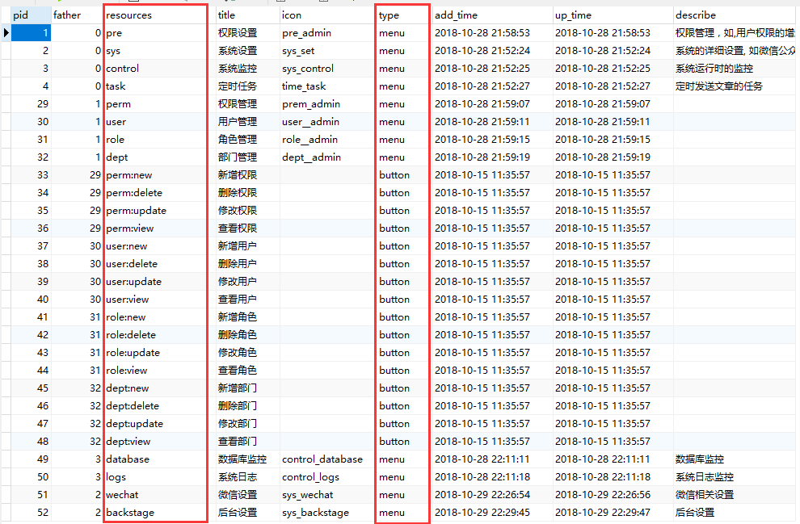

## 先从数据库开始

大部分的权限管理系统都是5张表结构（同样我们这里也采用这种方式）

### **t_sys_user -----> t_sys_user_role  -----> t_sys_role -----> t_sys_role_permission ----> t_sys_permission**

这里我们主要看权限表（t_sys_permission ）

最重要的就是resources和type字段，这两个字段在后面和vue.js整合的时候会用到，

### type字段，只有两个类型，是按钮还是菜单
