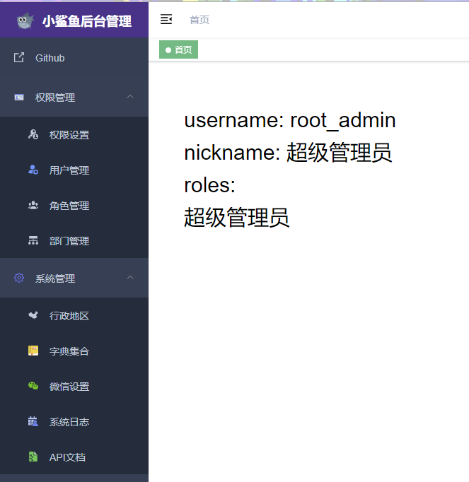
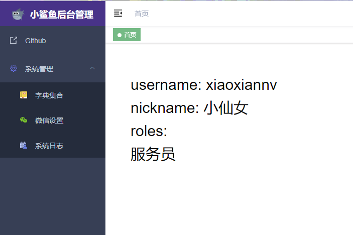
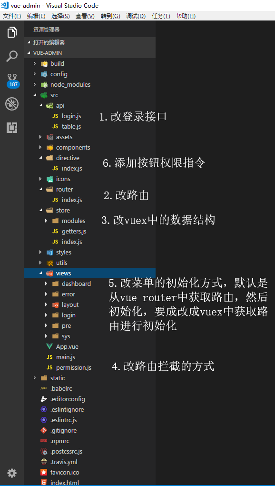

## 然后开始整合[**vue-element-admin**](https://github.com/PanJiaChen/vue-element-admin/blob/master/README.zh-CN.md)

先看一下成果。





从GitHub上面拉去[**vue-element-admin**](https://github.com/PanJiaChen/vue-element-admin/blob/master/README.zh-CN.md)




```npm
# 克隆项目
git clone https://github.com/PanJiaChen/vue-admin-template.git

# 建议不要用cnpm  安装有各种诡异的bug 可以通过如下操作解决npm速度慢的问题
npm install --registry=https://registry.npm.taobao.org

# Serve with hot reload at localhost:9528
npm run dev
```

**1.改登录的api接口指向我们spring boot 的登录**   目录 /src/api/login.js 

```js
import request from '@/utils/request'

// 登录
export function login(username, password) {
  return request({ url: '/auth/login', method: 'post', data: { username, password }})
}

// 获取用户信息
export function getInfo(token) {
  return request({ url: 'user/info', method: 'get' })
}

// 登出
export function logout() {
  return request({ url: 'user/logout', method: 'post' })
}

```

### **2.改axios的配置 目录**   /src/utils/request.js

```js
import axios from 'axios'
import { Message, MessageBox } from 'element-ui'
import store from '../store'
import { getToken } from '@/utils/auth'

// 创建axios实例
const service = axios.create({
  baseURL: process.env.BASE_API, // api 的 base_url
  timeout: 5000 // 请求超时时间
})

// request拦截器
service.interceptors.request.use(
  config => {
    if (getToken() !== '') {
      config.headers['jwtHeader'] = getToken() // 让每个请求携带自定义token 请根据实际情况自行修改
    }
    return config
  },
  error => {
    // Do something with request error
    console.log(error) // for debug
    Promise.reject(error)
  }
)

// response 拦截器
service.interceptors.response.use(
  response => {
    /**
     * code为非20000是抛错 可结合自己业务进行修改
     */
    const res = response.data
    if (res.status !== 200) {
      Message({
        message: res.message,
        type: 'error',
        duration: 5 * 1000
      })

      // 50008:非法的token; 50012:其他客户端登录了;  50014:Token 过期了;
      if (res.code === 400 || res.code === 401 || res.code === 402) {
        MessageBox.confirm('你已被登出，可以取消继续留在该页面，或者重新登录', '确定登出',
          { confirmButtonText: '重新登录',
            cancelButtonText: '取消',
            type: 'warning'
          }
        ).then(() => {
          store.dispatch('FedLogOut').then(() => {
            location.reload() // 为了重新实例化vue-router对象 避免bug
          })
        })
      }
      return Promise.reject('error')
    } else {
      return response.data
    }
  },
  error => {
    console.log('err' + error) // for debug
    Message({
      message: error.message,
      type: 'error',
      duration: 5 * 1000
    })
    return Promise.reject(error)
  }
)

export default service

```

### **3.改/config/dev.env.js 和/config/prod.env.js**

```javascript
// dev.env.js

'use strict'
const merge = require('webpack-merge')
const prodEnv = require('./prod.env')

module.exports = merge(prodEnv, {
  NODE_ENV: '"development"',
  BASE_API: '"http://localhost:8080"',
})


// prod.env.js

'use strict'
module.exports = {
  NODE_ENV: '"production"',
  BASE_API: '"http://localhost:8080"',
}


```

### **4.改vuex 设置token的登录，和获取用户信息**    目录 /src/store/modules/user.js

```javascript
import { login, logout, getInfo } from '@/api/login'
import { getToken, setToken, removeToken } from '@/utils/auth'

const user = {
  state: {
    token: getToken(),
    nickname: '',
    avatar: '',
    uid: '',
    user: {},
    roles: [],
    menus: [], // 菜单权限
    buttons: [] // 安装权限
  },

  mutations: {
    SET_TOKEN: (state, token) => {
      state.token = token
    },
    SET_INFO: (state, user) => {
      state.nickname = user.nickname
      state.avatar = user.avatar
      state.uid = user.uid
      state.user = user
    },
    SET_ROLES: (state, roles) => {
      state.roles = roles
    },
    SET_MENUS: (state, menus) => {
      state.menus = menus
    },
    SET_BUTTONS: (state, buttons) => {
      state.buttons = buttons
    }
  },

  actions: {
    // 登录
    Login({ commit }, userInfo) {
      const username = userInfo.username.trim()
      return new Promise((resolve, reject) => {
        login(username, userInfo.password).then(res => {
          setToken(res.data)
          commit('SET_TOKEN', res.data)
          resolve()
        }).catch(error => {
          reject(error)
        })
      })
    },

    // 获取用户信息
    GetInfo({ commit, state }) {
      return new Promise((resolve, reject) => {
        getInfo(state.token).then(res => {
          const data = res.data
          if (data.roles && data.roles.length > 0) { // 验证返回的roles是否是一个非空数组
            commit('SET_ROLES', data.roles)
          } else {
            reject('getInfo: roles must be a non-null array !')
          }
          commit('SET_MENUS', data.menus)
          commit('SET_BUTTONS', data.buttons)
          // 设置用户信息
          commit('SET_INFO', data)
          resolve(res)
        }).catch(error => {
          reject(error)
        })
      })
    },

    // 登出
    LogOut({ commit, state }) {
      return new Promise((resolve, reject) => {
        logout(state.token).then(() => {
          commit('SET_INFO', '')
          commit('SET_TOKEN', '')
          commit('SET_ROLES', [])
          removeToken()
          resolve()
        }).catch(error => {
          reject(error)
        })
      })
    },

    // 前端 登出
    FedLogOut({ commit }) {
      return new Promise(resolve => {
        commit('SET_TOKEN', '')
        removeToken()
        resolve()
      })
    }
  }
}

export default user

```

### **5.改vue router**  目录 /src/router/index.js

```javascript
import Vue from 'vue'
import Router from 'vue-router'

Vue.use(Router)

import Layout from '@/views/layout/Layout'
// 默认的路由链。所有用户公共的路由
export const constantRouterMap = [
  {
    path: '/login',
    name: 'Login',
    component: () =>
      import('@/views/login/index'),
    hidden: true
  },

  {
    path: '/',
    component: Layout,
    redirect: '/dashboard',
    name: 'Dashboard',
    hidden: true,
    children: [{
      path: 'dashboard',
      component: () =>
        import('@/views/dashboard/index')
    }, {
      path: 'userinfo',
      name: 'UserInfo',
      component: () =>
        import('@/views/dashboard/userinfo')
    }]
  },

  {
    path: '/error',
    component: Layout,
    redirect: '/error/404',
    hidden: true,
    children: [{
      path: '404',
      component: () =>
        import('@/views/error/404/index')
    }, {
      path: '401',
      component: () =>
        import('@/views/error/401/index')
    }]
  },
  {
    path: '*',
    redirect: '/error/404',
    hidden: true
  }
]

export default new Router({
  // mode: 'history', //后端支持可开
  scrollBehavior: () => ({ y: 0 }),
  routes: constantRouterMap
})

// 异步挂载的路由
// 动态需要根据权限加载的路由表
// 这个路由链，根据数据库中的一一对应，也就是说这是一个最完整的路由链，
// 根据登录的用户权限的不同，然后从中提取出对应当前用户的路由添加到vue router中
// meta:属性中resources属性最为重要，用meta.resources和我们获取用户信息中menus.resources匹配
export const asyncRouterMap = [
  {
    path: '/pre',
    component: Layout,
    name: 'pre',
    meta: {
      resources: 'pre',
      title: '权限管理'
    },
    children: [
      {
        path: 'index',
        component: () => import('@/views/pre/perm/index'),
        name: 'perm',
        meta: {
          resources: 'perm'
        }
      },
      {
        path: 'user',
        component: () => import('@/views/pre/user/index'),
        name: 'user',
        meta: {
          resources: 'user'
        }
      },
      {
        path: 'role',
        component: () => import('@/views/pre/role/index'),
        name: 'role',
        meta: {
          resources: 'role'
        }
      },
      {
        path: 'dept',
        component: () => import('@/views/pre/dept/index'),
        name: 'dept',
        meta: {
          resources: 'dept'
        }
      }
    ]
  },

  {
    path: '/sys',
    component: Layout,
    name: 'sys',
    meta: {
      resources: 'sys',
      title: '系统设置'
    },
    children: [
      {
        path: 'index',
        component: () => import('@/views/sys/backstage/index'),
        name: 'backstage',
        meta: {
          resources: 'backstage'
        }
      },
      {
        path: 'wechat',
        component: () => import('@/views/sys/wechat/index'),
        name: 'wechat',
        meta: {
          resources: 'wechat'
        }
      }
    ]
  },

  {
    path: 'external-link',
    component: Layout,
    name: 'Link',
    meta: {
      resources: 'control',
      title: '系统监控',
      icon: 'link'
    },
    children: [{
      path: 'https://www.baidu.com/',
      meta: {
        resources: 'logs',
        title: '系统日志',
        icon: 'link'
      }
    },
    {
      path: 'https://v.qq.com/',
      meta: {
        resources: 'database',
        title: '数据库监控',
        icon: 'link'
      }
    }
    ]
  }

]

```

### **6.添加权限管理，并且添加vuex中****    目录 /src/store/modules/permission.js

```javascript
// store/permission.js
import { asyncRouterMap, constantRouterMap } from '@/router'

/**
 *
 * @param  {Array} userRouter 后台返回的用户权限json
 * @param  {Array} allRouter  前端配置好的所有动态路由的集合
 * @return {Array} realRoutes 过滤后的路由
 */

export function recursionRouter(userRouter = [], allRouter = []) {
  var realRoutes = []
  allRouter.forEach((v, i) => {
    userRouter.forEach((item, index) => {
      if (item.resources === v.meta.resources) {
        if (item.children && item.children.length > 0) {
          v.children = recursionRouter(item.children, v.children)
        }
        v.meta.title = item.title
        v.meta.icon = item.icon
        realRoutes.push(v)
      }
    })
  })
  return realRoutes
}

/**
*
* @param {Array} routes 用户过滤后的路由
*
* 递归为所有有子路由的路由设置第一个children.path为默认路由
*/
export function setDefaultRoute(routes) {
  routes.forEach((v, i) => {
    if (v.children && v.children.length > 0) {
      v.redirect = { name: v.children[0].name }
      setDefaultRoute(v.children)
    }
  })
}

const permission = {
  state: {
    routers: constantRouterMap, // 这是默认权限列表 比如404 500等路由
    dynamicRouters: [] // 这是通过后台获取的权利列表
  },
  mutations: {
    SET_ROUTERS: (state, routers) => {
      state.dynamicRouters = routers
      state.routers = constantRouterMap.concat(routers)
    }
  },
  actions: {
    GenerateRoutes({ commit }, data) {
      return new Promise(resolve => {
          // 把传进来的menus 列表。用recursionRouter方法进行递归遍历出来，存入vuex中
        commit('SET_ROUTERS', 。(data, asyncRouterMap))
        resolve()
      })
    }
  }
}

export default permission

```

### **7.修改/src/permission.js文件，修改路由调整的条件**

```javascript
import router from './router'
import store from './store'
import NProgress from 'nprogress' // Progress 进度条
import 'nprogress/nprogress.css'// Progress 进度条样式
import { Message } from 'element-ui'
import { getToken } from '@/utils/auth' // 验权

const whiteList = ['/login'] // 不重定向白名单
router.beforeEach((to, from, next) => {
  NProgress.start()
  if (getToken()) {
    if (to.path === '/login') {
      next({ path: '/' })
      NProgress.done() // if current page is dashboard will not trigger	afterEach hook, so manually handle it
    } else {
      if (store.getters.menus.length === 0) {
        // 拉取用户信息(请确保在 GetInfo 方法中 已经获取到菜单列表)
        store.dispatch('GetInfo').then(res => {
          // 动态设置路由（把上一步获取到的用户传递给 GenerateRoutes方法 解析）
          store.dispatch('GenerateRoutes', store.getters.menus).then(r => {
            // 获取已经解析好的路由列表，动态添加到router中
            router.addRoutes(store.getters.dynamicRouters)
            // hack方法 确保addRoutes已完成
            next({ ...to, replace: true })
          })
        }).catch((err) => {
          store.dispatch('FedLogOut').then(() => {
            Message.error(err || 'Verification failed, please login again')
            next({ path: '/' })
          })
        })
      } else {
        next()
      }
    }
  } else {
    if (whiteList.indexOf(to.path) !== -1) {
      next()
    } else {
      next(`/login?redirect=${to.path}`) // 否则全部重定向到登录页
      NProgress.done()
    }
  }
})

router.afterEach(() => {
  NProgress.done() // 结束Progress
})

```

### **8.修改菜单渲染的方式，默认是从vue router中读取路由链，然后渲染，但是我们现在的路由链存在vuex中，**

目录: /src/views/layout/components/Sidebar/index.vue

```javascript
<template>
  <el-scrollbar wrap-class="scrollbar-wrapper">

    <logo :is-collapse="isCollapse"/>

    <el-menu
      :show-timeout="200"
      :default-active="$route.path"
      :collapse="isCollapse"
      mode="vertical"
      background-color="#304156"
      text-color="#bfcbd9"
      active-text-color="#409EFF"
    >
      
   		<!-- 主要就是在这里位置  menu_routers -->
      <sidebar-item v-for="route in menu_routers" :key="route.path" :item="route" :base-path="route.path"/>
    </el-menu>
  </el-scrollbar>
</template>

<script>
import { mapGetters } from 'vuex'
import SidebarItem from './SidebarItem'
import logo from './Logo'

export default {
  components: {
    SidebarItem,
    logo
  },
  computed: {
      // 在这里从vuex 中获取到菜单列表
    ...mapGetters([
      'menu_routers',
      'sidebar'
    ]),
    isCollapse() {
      return !this.sidebar.opened
    }
  }
}
</script>

```

### **到现在为止已经做到动态的菜单了，还剩按钮的权限，按钮比较简单，添加一个vue 的指令即可**

```javascript
import Vue from 'vue'
import store from '@/store'

/** 权限指令**/

Vue.directive('has', {
  bind: function(el, binding) {
    if (!Vue.prototype.$_has(binding.value)) {
      el.parentNode.removeChild(el)
    }
  }
})

// 权限检查方法
Vue.prototype.$_has = function(value) {
  // 获取用户按钮权限
  let isExist = false
  const dynamicButtons = store.getters.buttons
  if (dynamicButtons === undefined || dynamicButtons === null || dynamicButtons.length < 1) {
    return isExist
  }
  dynamicButtons.forEach(button => {
    if (button.resources === value) {
      isExist = true
      return isExist
    }
  })
  return isExist
}

```

### **在页面中测试一下指令是否好用**

```html
    
<!-- v-has中的值就是我们获取用户信息时buttons的resources属性。进行对比， -->

<el-button v-has="'perm:new'" class="btns">添加</el-button>

<el-button v-has="'perm:haha'" class="btns">哈哈</el-button>

```

**到了这里已经完成了  spring boot ，security ，jwt，vue-admin-template的整合 一个完整的前后端分类，动态权限，控制到按钮的 后台管理系统就完成了**


### 有钱的兄弟捧个钱场，没钱的捧个人场


